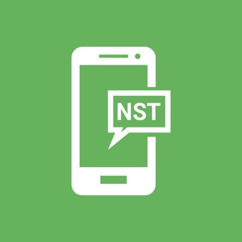

# Notify Send Telegram



Send server/desktop notifications to Telegram. Can be used as reminder with cron, log monitor (see `examples/syslog-monitor.sh`), update notifier, etc.

## How to use

See [requirements](#requirements) for environment information

1. Create your bot via [Bot Father](https://t.me/BotFather)
2. Copy _token_ of your bot
3. Get your _user id_ via [@get_id_bot](https://t.me/get_id_bot)
4. Press "Start" button to give your bot permission to send messages
5. Start script: `./notify-send-telegram.py -t YOUR_TOKEN -r USER_ID 'Hello world'`

You will get 'Hello world' message from your bot. Token and user id will be saved to config file. If you want to override them, just add option `--save`.

Examples:

- `./notify-send-telegram.py 'New message' 'Lorem ipsum'`
- `./notify-send-telegram.py 'Just title'`
- `./notify-send-telegram.py --silent 'Unimportant event' 'Some description'`

### Requirements

- Python 3 and pip3
- `requests` python module (see below)

Only for user: `pip3 install --user requests`

System-wide: `sudo -H pip3 install requests`

## Extended documentation

```
usage: notify-send-telegram.py [options] SUMMARY [BODY]

positional arguments:
  SUMMARY               Notification title, for example 'New mail'
  BODY                  Text of notification, multi-line supported. If BODY
                        isn't set, just the SUMMARY is sent

optional arguments:
  -h, --help            show this help message and exit
  -n, --silent          send notification with no sound
  -r chat_id, --recipient chat_id
                        telegram chat_id (user_id) to send notification
  -t TOKEN, --token TOKEN
                        set telegram bot token to use
  -z, --save            save recipient & token to config file and use them as
                        defaults in future
```

## License

MIT

